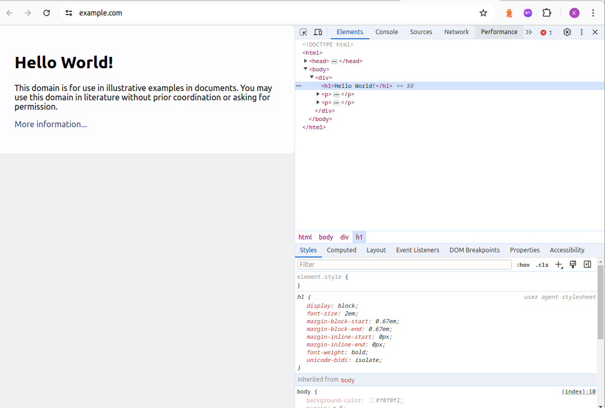
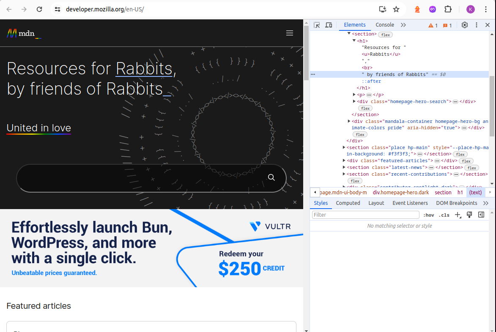

# Developer tools

Here you will practise using the browser developer tools.

## Tasks

> Modify this `README.md` by adding your answers directly in the 'Answer' section.

### Task 1

- Question: Open [https://digitalcareerinstitute.org](https://digitalcareerinstitute.org) and inspect the DCI logo. Copy the element HTML and paste it below:
- Answer: ``

### Task 2

- Question: Open [https://www.bahn.de](https://www.bahn.de) and inspect the source code. Which attributes does its `<html>` element have?
- Answer: `class, lang, data-whatintent and data-whatinput`

### Task 3

- Question: Open [https://example.com](https://example.com) and change the text of its `<h1>` element to `Hello World!`. Take a screenshot of the result and **add it as a Markdown link below**:
- Answer: 

### Task 4

- Question: Open [https://example.com](https://example.com) and inspect it. What is the exact background color used?
- Answer: `#f0f0f2`

### Task 5

- Question: Open [https://facebook.com](https://facebook.com) and inspect it. What is the `font-family` used to show the text in the **Log In** button?
- Answer: `Helvetica, Arial, sans-serif
`

### Task 6

- Question: Open [https://developer.mozilla.org](https://developer.mozilla.org) and inspect it. Change the text on the page to match the encircled area in [this screenshot](/task-6-example.png). Then take your own screenshot and **add a link to it below**!
- Answer: 
