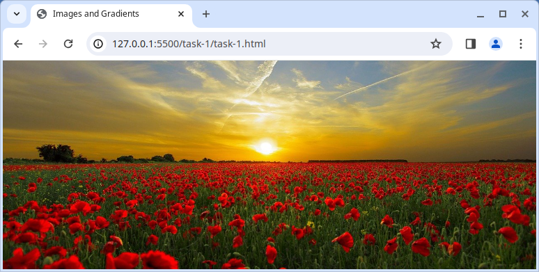
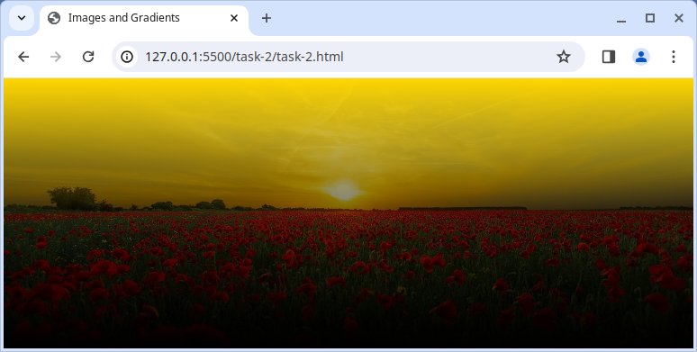
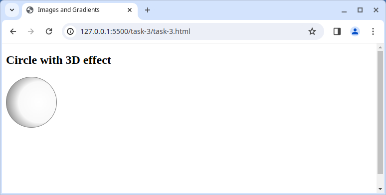

# Images and gradients

Here you will get to play with a series of tasks for CSS images and gradients!

## Tasks

For the following tasks, you will be working in separate HTML and CSS files for each task.

- Don't edit the HTML files
- Some CSS has already been prepared for you, but you will need to update it

### Task 1 - Background image

- HTML in [task-1/task-1.html](task-1/task-1.html)
- CSS in [task-1/task-1.css)](task-1/task-1.css)

Using CSS, set the background of the `<body>` to an image;

- Use the image [assets/background-sunset.jpg](assets/background-sunset.jpg) as the background image
- Make the image cover the entire `<body>` element
- The image should be centered
- The image should not be repeated

### Task 2 - Linear gradient

Using the CSS `background` property and `linear-gradient()` function, apply a gradient over the image.

The gradient should use the following 3 colors, in this order;

- `gold`
- `rgba(0,0,0,0.5)` (a transparent black color)
- `#000` (black)

> [CSS3 Gradients](https://css-tricks.com/css3-gradients/)

### Task 3 - Circle with 3D effect

Using the CSS `background` property and `radial-gradient()` function, apply a gradient effect on the circle to give it a 3D look.

Use the following properties for your gradient, in this order;

- `circle at 65%`
- `rgba(255, 255, 255, 1)`
- `#f9f9f9`
- `#555`

> [CSS3 Radial-gradients](https://css-tricks.com/css3-gradients/#aa-radial-gradients)
