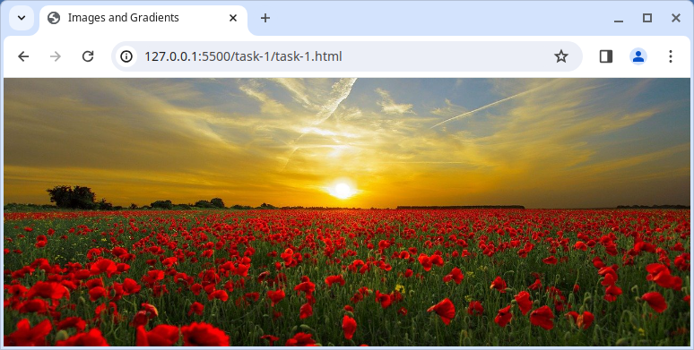

# Bilder und Verläufe

Wusstest Du, dass Du auch visuelle Effekte mit CSS erstellen kannst? Hier wirst Du eine Reihe von Aufgaben für CSS-Bilder und Verläufe bearbeiten!

## Aufgaben

Für die folgenden Aufgaben wirst Du in den Dateien `index.html` und `style.css` arbeiten.

- Du musst die Datei `index.html` nicht bearbeiten
- Einige CSS ist bereits für Dich vorbereitet, aber Du wirst es aktualisieren müssen

### Aufgabe 1 - Hintergrundbild

Setze mit CSS das Hintergrundbild des `<body>` auf ein Bild;

- Verwende das Bild [assets/background-sunset.jpg](assets/background-sunset.jpg) als Hintergrundbild
- Das Bild sollte das gesamte `<body>`-Element abdecken
- Das Bild sollte zentriert sein
- Das Bild sollte nicht wiederholt werden

### Aufgabe 2 - Linearer Verlauf

Verwende die CSS-Eigenschaft `background` und die Funktion `linear-gradient()`, um einen Verlauf über das Bild zu legen.

Der Verlauf sollte die folgenden 3 Farben verwenden, in dieser Reihenfolge;

- `gold`
- `rgba(0,0,0,0.5)` (eine transparente schwarze Farbe)
- `#000` (schwarz)

> [CSS3 Verläufe](https://css-tricks.com/css3-gradients/)

### Aufgabe 3 - Kreis mit 3D-Effekt

Verwende die CSS-Eigenschaft `background` und die Funktion `radial-gradient()`, um einen Verlaufseffekt auf den Kreis anzuwenden, der ihm ein 3D-Aussehen verleiht.

Verwende die folgenden Eigenschaften für Deinen Verlauf, in dieser Reihenfolge;

- `circle at 65%`
- `rgba(255, 255, 255, 1)`
- `#f9f9f9`
- `#555`

> [CSS3 Radiale Verläufe](https://css-tricks.com/css3-gradients/#aa-radial-gradients)
