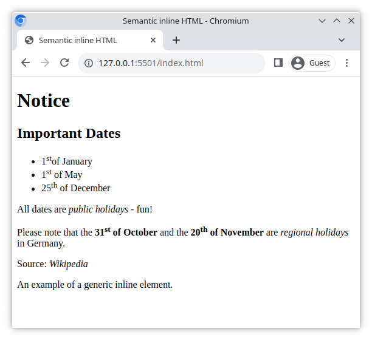

# Semantic inline HTML

This exercise is about practicing semantic inline elements, without any CSS.

## What you will be doing

Working in the included `index.html`, perform the tasks below using only semantic inline elements.

Refer to the screenshot below for an example of the final result.

## Tasks

### Task 1

Apply the `` element on ordinal number endings, for example _th_ and _st_ which may appear after a number.

> Reference: [MDN: sup](https://developer.mozilla.org/en-US/docs/Web/HTML/Element/sup)

### Task 2

Apply the `<strong>` element on all dates inside the paragraph with the class `note`.

> Reference: [MDN: strong](https://developer.mozilla.org/en-US/docs/Web/HTML/Element/strong)

### Task 3

Apply the `<em>` element whereever you see the phrases **public holidays** and **regional holidays**.

> Reference: [MDN: em](https://developer.mozilla.org/en-US/docs/Web/HTML/Element/em)

### Task 4

Use the `<cite>` element to cite the source **Wikipedia** in the footer

> Reference: [MDN: cite](https://developer.mozilla.org/en-US/docs/Web/HTML/Element/cite)

### Task 5

Research the following questions on [MDN](https://developer.mozilla.org/en-US/).

Add your answers directly here into the README;

1. What is the difference between `<strong>` and `<b>`?
  `<strong>` element tag is used for emphasizing the important text and enhancing the semantic meaning of your content. while `<b>` element tag is used for just make the text bold and for purely visual purposes.
2. What is the difference between `<em>` and `<i>`?
  `<em>` element tag is used for emphasizing the text while `<b>` element tag is used to make the text italic.
3. What is the use case for `<q>`?
 As `<q>` elemen tag is used for short quotations within a quotation marks so following is the use case:
 According to the article, <q>climate change is accelerating</q> due to various factors.
4. Which is the first version of Safari to support ``?
  The first version of Safari to suport the  `` element tag was Safari 1.0, released in 2003.

### Optional Bonus Challenge Task

The `<strike>` element is deprecated

1. What does that mean?
 When an HTML element or attribute is deprecated, it means that it is no longer recommended for use and may be removed in future versions of HTML.
2. How can you achieve the same result with a `` element and CSS?
 The `` elemen tag will be used for wraping up the text and css property "**text-decoration: line-through;**" will be used to fullfil the purpose of strike element.
3. How can you achieve the same result... without CSS?
  To achieve the same results, `<del>` element tag can be used.
