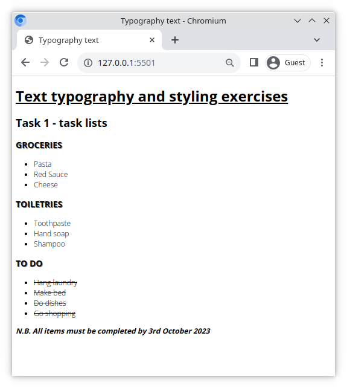
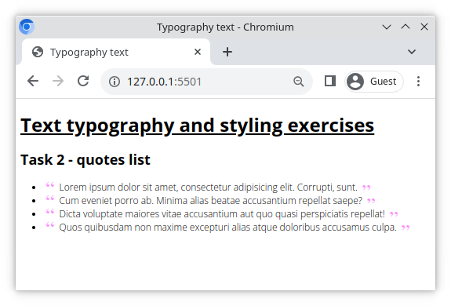
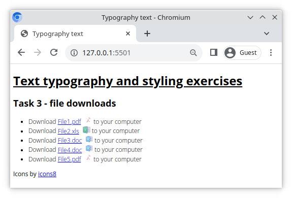
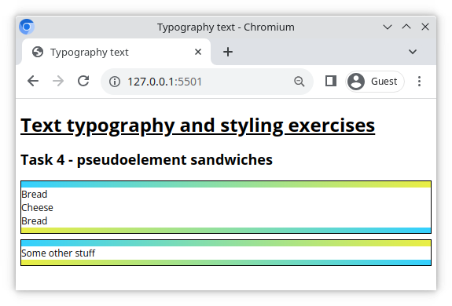

# Typography text

This exercise is a series of typography tasks.

## What you will be doing

Work in the included HTML file and create a CSS file called `style.css`. After that complete the tasks below. Good luck!

## Tasks

### Task 1

- Choose a font on [Google Fonts](https://fonts.google.com/) and import using the HTML link tag
- Select different font weights e.g. light(300), regular(400), bold(700)
- Apply the font to all the elements on the page
- Underline the `<h1>` heading
- Give all list items a light _300_ font weight
- Give all headings with the class `.heading` a shadow and, in CSS, make all these elements appear uppercase
- Give the element with the class `.note` a bold font weight. Make the text appear italic.
- Strike through all the elements with the class `.todo-item`

### Task 2

- Using the pseudo elements `::before` and `::after`, replicate the file link list shown in the image below
- Generate an unordered list of lorem ipsum quotes using the emmet abbreviation `#quotes>ul>(li>lorem10)*5`
- Apply pseudo elements to place a quote icon before and after each quote
- Use the included [quote.png](./quote.png) for the source image

> Hint: You can rotate an element 180 degrees using `rotate:180deg;`

### Task 3

- Using a mixture of class selectors and the pseudo element `::after`, replicate the file link list shown in the image below
- After each file name in the link list we want to display the corresponding file type as an icon
  - Include the following file types in the link list: `.pdf`,`.xls`, `.doc`
  - Icons
    - PDF: https://img.icons8.com/officel/64/000000/pdf.png
    - XLS: https://img.icons8.com/dusk/64/000000/ms-excel.png
    - DOC: https://img.icons8.com/dusk/64/000000/ms-word.png
- The icons are not free to use. Include a backlink to [icons8](https://icons8.com/) as demonstrated [here](https://icons8.com/license)

### Task 4

- Using the pseudo elements `::before` and `::after`, create the "sandwich div" shown below
- _Hint_: don't use the `border` for the gradients
  - Make the pseudo elements block level elements
  - Add width and height and give the pseudo elements a linear gradient background

[//]: # (autograding info start)
#  Results
> ⌛ Give it a minute. As long as you see the orange dot  on top, CodeBuddy is still processing. Refresh this page to see it's current status.
>
> This is what CodeBuddy found when running your code. It is to show you what you have achieved and to give you hints on how to complete the exercise.

### Task 1

|                 Status                  | Check                                                                                    |
| :-------------------------------------: | :--------------------------------------------------------------------------------------- |
|  | Page is using Google fonts |
|  | Multiple different font weights are used |
|  | H1 headline is underlined |
|  | List items have a light font weight |
|  | `.heading` has a shadow and is in uppercase |
|  | `.note` has `bold` font weight and is `italic` |
|  | `.todo-item` is stricken through |

### Task 2

|                 Status                  | Check                                                                                    |
| :-------------------------------------: | :--------------------------------------------------------------------------------------- |
|  | List elements have `:before` pseudo element |
|  | List elements have `:after` pseudo element |
|  | Pseudo elements use 'quote' image |

### Task 3 - File downloads

|                 Status                  | Check                                                                                    |
| :-------------------------------------: | :--------------------------------------------------------------------------------------- |
|  | Files list should include link to a PDF file |
|  | Files list should include link to an XLS file |
|  | Files list should include link to a DOC file |
|  | Link elements have `:after` pseudo element |
|  | Pseudo elements use icon images |

### Task 4 - Gradient sandwich

|                 Status                  | Check                                                                                    |
| :-------------------------------------: | :--------------------------------------------------------------------------------------- |
|  | Sandwich section should be styled using linear gradients |

[🔬 Results Details](../../actions)
[🐞 Tips on Debugging](https://github.com/DCI-EdTech/autograding-setup/wiki/How-to-work-with-CodeBuddy)
[📢 Report Problem](https://docs.google.com/forms/d/e/1FAIpQLSfS8wPh6bCMTLF2wmjiE5_UhPiOEnubEwwPLN_M8zTCjx5qbg/viewform?usp=pp_url&entry.652569746=uib-design-typography-text)

[//]: # (autograding info end)