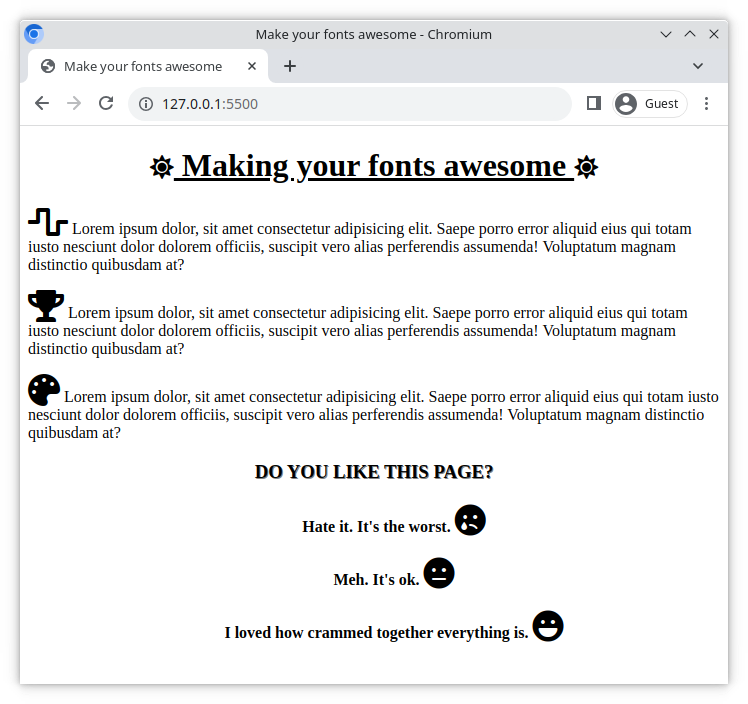

# Make your fonts awesome!

Font Awesome is a popular toolkit, which makes it easy to implement icons onto your website. Here you will get a chance to use it to enhance an existing page!

## Task

A website has already been built for you (see [index.html](./index.html), and [style.css](./style.css)). Complete this exercise by fulfilling the requirements below.

## Requirements

> Before starting, setup **Font Awesome** to work on your website! If you're not sure, ask your teacher or follow the [online guide](https://fontawesome.com/start)

- Add a Font Awesome icon to the start and end of the `<h1>` heading
- Center and underline the `<h1>` heading
- Center the element with the class `.review`. Give this element a text shadow and use CSS to format the text as UPPERCASE.
- Add icons to the beginning of each `
` element nested in the sections with class `.info`
- Add an appropriate icon after each review option
- Set a size for the icons on the page

### Example

Here is an example of how your website might look (your icons might be different);

[//]: # (autograding info start)
#  Results
> ⌛ Give it a minute. As long as you see the orange dot  on top, CodeBuddy is still processing. Refresh this page to see it's current status.
>
> This is what CodeBuddy found when running your code. It is to show you what you have achieved and to give you hints on how to complete the exercise.

### Font awesome CDN

|                 Status                  | Check                                                                                    |
| :-------------------------------------: | :--------------------------------------------------------------------------------------- |
|  | Page should contain a Font awesome CDN link |

### H1 tag

|                 Status                  | Check                                                                                    |
| :-------------------------------------: | :--------------------------------------------------------------------------------------- |
|  | `H1` tag should have font awesome icon |
|  | `H1` tag should be centered |
|  | `H1` tag should be underlined |

### Review

|                 Status                  | Check                                                                                    |
| :-------------------------------------: | :--------------------------------------------------------------------------------------- |
|  | `.review` element should be centered |
|  | `.review` element should have text shadow |
|  | `.review` element should be uppercase |

### Info paragraphs

|                 Status                  | Check                                                                                    |
| :-------------------------------------: | :--------------------------------------------------------------------------------------- |
|  | `p` tags in `.info` should contain font awesome icons  |

[🔬 Results Details](../../actions)
[🐞 Tips on Debugging](https://github.com/DCI-EdTech/autograding-setup/wiki/How-to-work-with-CodeBuddy)
[📢 Report Problem](https://docs.google.com/forms/d/e/1FAIpQLSfS8wPh6bCMTLF2wmjiE5_UhPiOEnubEwwPLN_M8zTCjx5qbg/viewform?usp=pp_url&entry.652569746=uib-design-fontawesome)

[//]: # (autograding info end)