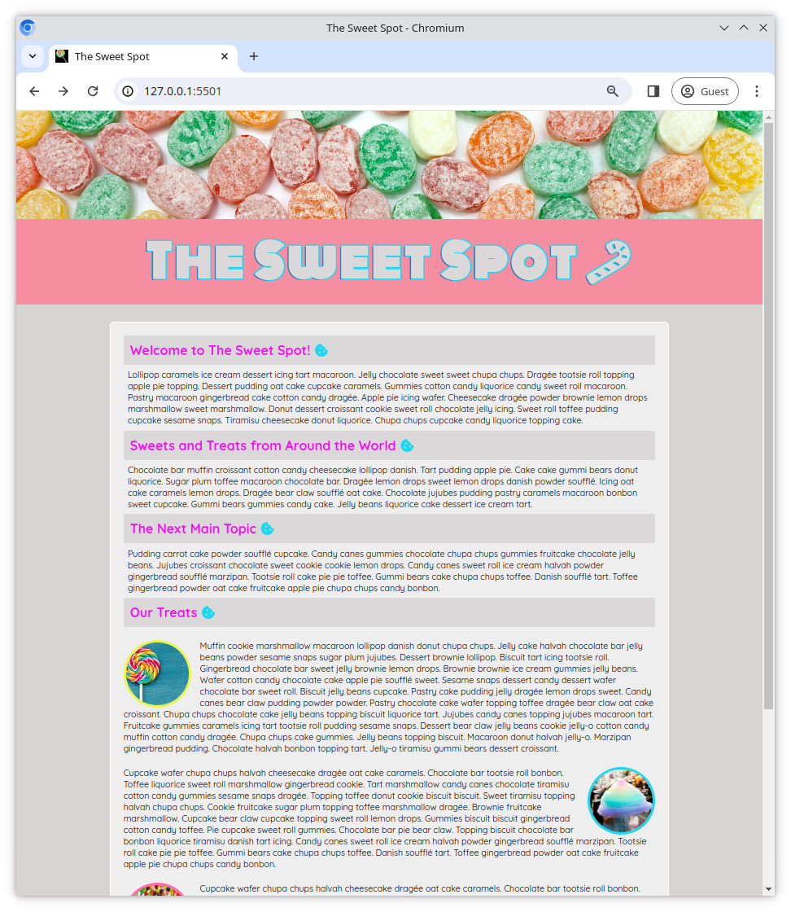
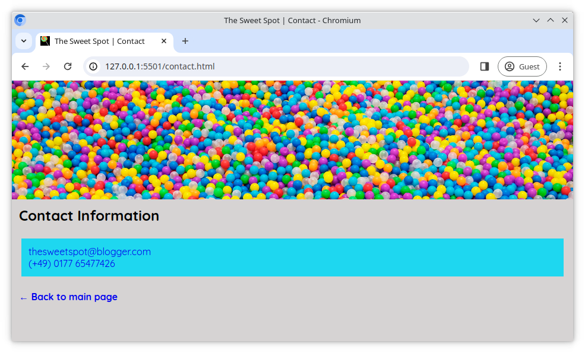

# The Sweet Spot v4

Let's improve the website _The Sweet Spot_ by adding some new additions to our user interface to make it a bit more modern and professional.

## Task

Some HTML ([index.html](/index.html), [contact.html](/contact.html)) and CSS ([style.css](/style.css)) have already been prepared for you. Working in these files, complete the requirements outlined below. You can use the reference images as a guide.

## Requirements

- Use `lollipop.ico` from the `images` directory as the icon for your page. It should display in the browser tab.
- Import the **Quicksand** and **Monoton** fonts from **Google Fonts** and use as shown in the reference images
- Add a `text-shadow` to the `h1` element in the `header` to achieve the outline effect in the reference images
- From [Fontawesome](https://fontawesome.com/), add the **candy cane** and **cookie** icons to the page
- Add the **back arrow** to the "**Back to main page**" text on the contact page
- Take a few moments to look at the [live version](https://digitalcareerinstitute.github.io/UIB-UI-UX-the-sweet-spot-v4/) and implement any other small changes that are present
- As always, aim to be **pixel perfect**, matching the design screenshot as closely as possible 😀

### Reference images

#### Main Page

#### Contact Page

[//]: # (autograding info start)
#  Results
> ⌛ Give it a minute. As long as you see the orange dot  on top, CodeBuddy is still processing. Refresh this page to see it's current status.
>
> This is what CodeBuddy found when running your code. It is to show you what you have achieved and to give you hints on how to complete the exercise.

### HTML structure

|                 Status                  | Check                                                                                    |
| :-------------------------------------: | :--------------------------------------------------------------------------------------- |
|  | `index.html` should contain appropriate meta tags |
|  | `index.html` should contain a title tag that is not empty |

### Font size

|                 Status                  | Check                                                                                    |
| :-------------------------------------: | :--------------------------------------------------------------------------------------- |
|  | `:root` pseduo-class should be used to set the font-size |

### Favicon

|                 Status                  | Check                                                                                    |
| :-------------------------------------: | :--------------------------------------------------------------------------------------- |
|  | 'lollipop.ico' image should be used as the favicon |

### Google fonts

|                 Status                  | Check                                                                                    |
| :-------------------------------------: | :--------------------------------------------------------------------------------------- |
|  | 'Quicksand' and 'Monoton' Google fonts should be used |

### Header styling

|                 Status                  | Check                                                                                    |
| :-------------------------------------: | :--------------------------------------------------------------------------------------- |
|  | H1 tag in the Header should have text-shadow |

### Font awesome Icons

|                 Status                  | Check                                                                                    |
| :-------------------------------------: | :--------------------------------------------------------------------------------------- |
|  | Font awesome icons should be used on the page |

### Contact Page

|                 Status                  | Check                                                                                    |
| :-------------------------------------: | :--------------------------------------------------------------------------------------- |
|  | The 'Drop me a line' link Should redirect to `contact.html` page |
|  | Contact Page Should contain a 'go back' link to index.html |
|  | Contact page exists |

[🔬 Results Details](../../actions)
[🐞 Tips on Debugging](https://github.com/DCI-EdTech/autograding-setup/wiki/How-to-work-with-CodeBuddy)
[📢 Report Problem](https://docs.google.com/forms/d/e/1FAIpQLSfS8wPh6bCMTLF2wmjiE5_UhPiOEnubEwwPLN_M8zTCjx5qbg/viewform?usp=pp_url&entry.652569746=uib-design-sweet-spot-v4)

[//]: # (autograding info end)