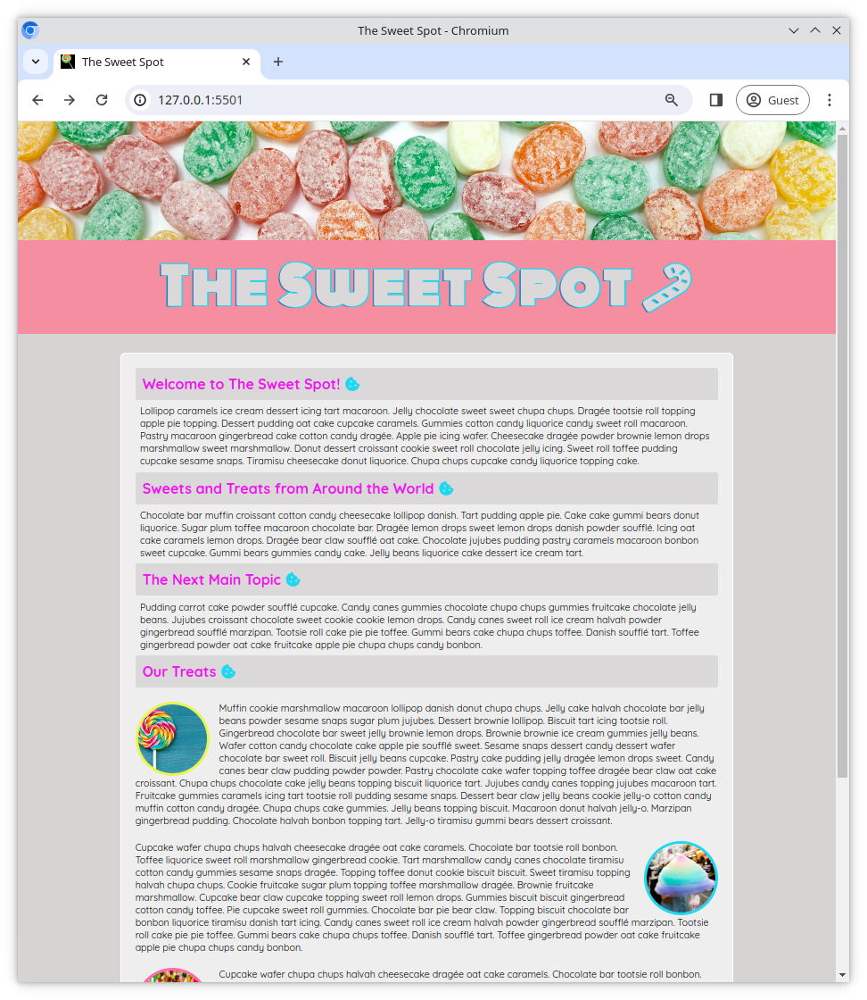
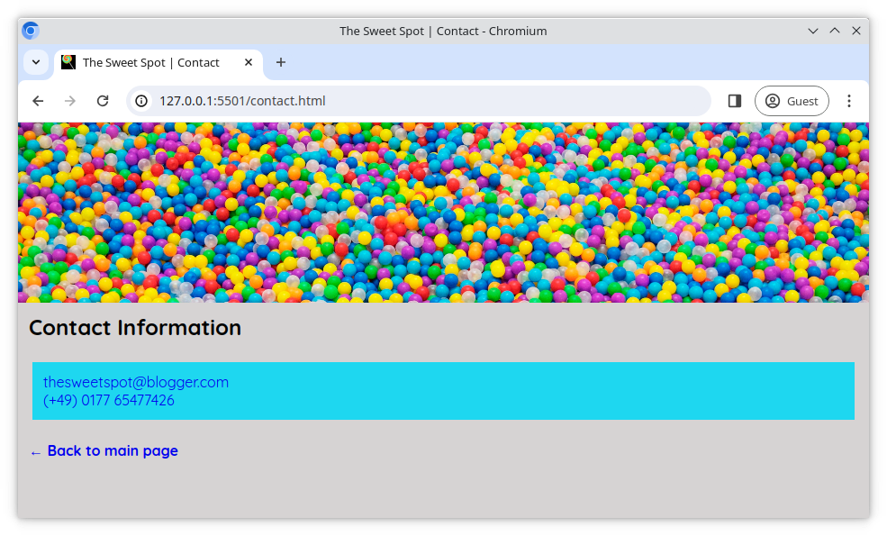

# The Sweet Spot v4

Lass uns die Webseite _The Sweet Spot_ verbessern, indem wir einige neue Ergänzungen zu unserer Benutzeroberfläche hinzufügen, um sie ein bisschen moderner und professioneller zu machen.

## Aufgabe

Einige HTML ([index.html](/index.html), [contact.html](/contact.html)) und CSS ([style.css](/style.css)) Dateien wurden bereits für dich vorbereitet. Arbeite in diesen Dateien und erfülle die unten aufgeführten Anforderungen. Du kannst die Referenzbilder als Leitfaden verwenden.

## Anforderungen

- Verwende `lollipop.ico` aus dem Verzeichnis `images` als Icon für deine Seite. Es sollte im Browser-Tab angezeigt werden.
- Importiere die Schriftarten **Quicksand** und **Monoton** von **Google Fonts** und verwende sie wie in den Referenzbildern gezeigt
- Füge dem Element `h1` in der `header` einen `text-shadow` hinzu, um den Umriss-Effekt im Referenzbild zu erzielen.
- Füge von [Fontawesome](https://fontawesome.com/) die Icons **candy cane** und **cookie** auf der Seite ein
- Füge den **back arrow** zum Text '**Back to main page**' auf der Kontaktseite hinzu
- Nimm dir ein paar Minuten Zeit, um dir die [Live-Version](https://digitalcareerinstitute.github.io/UIB-UI-UX-the-sweet-spot-v4/) anzuschauen und implementiere alle anderen kleinen Änderungen, die vorhanden sind
- Wie immer gilt: Strebe an, **pixelgenau** zu sein und dem Design-Screenshot so genau wie möglich zu entsprechen 😀

### Referenzbilder

#### Hauptseite

#### Kontakt Seite

