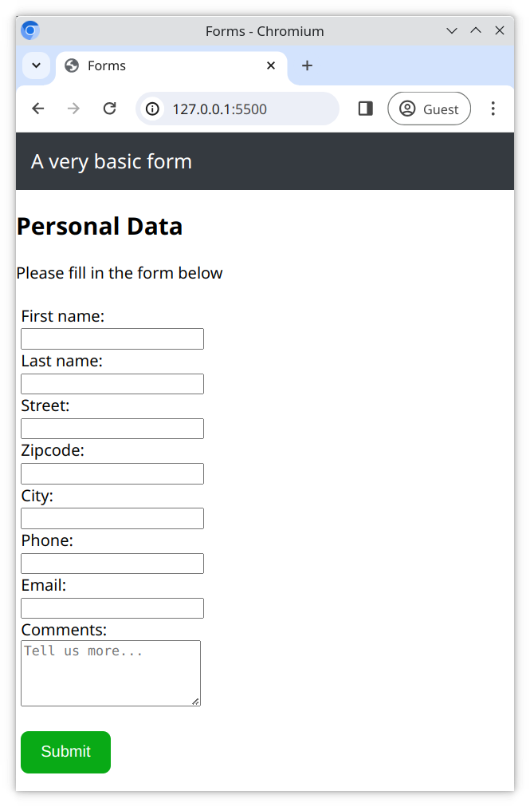

# A Basic Form

We can collect data from a user with a form. Here you will create a simple order form to collect some basic personal data (name, address, etc).

## Task

Working in the files [index.html](./index.html) and [style.css](./style.css), create a form which meets the following requirements.

## Requirements

- Use `<input>` or `<textarea>` fields to collect the following information;
  - First Name
  - Last Name
  - Street
  - Zipcode
  - City
  - Phone Number
  - E-mail
  - Comments
- Use a `<label>` tag for each `<input>` or `<textarea>` field
- Use the appropriate **Input type** for each `<input>` field. For example, `email` for the **E-mail** address
- Include a **Submit** `<button>`
- Ensure the `<input>` fields appear in a single column, and not side by side
- Style your form elements using CSS
- Add a `<header>` to your page
- Use the reference image below as your style guide

> Don't forget to begin your webpage with the boilerplate HTML5 code!

## Reference Image

[//]: # (autograding info start)
#  Results
> ⌛ Give it a minute. As long as you see the orange dot  on top, CodeBuddy is still processing. Refresh this page to see it's current status.
>
> This is what CodeBuddy found when running your code. It is to show you what you have achieved and to give you hints on how to complete the exercise.

### Form - Personal Data

|                 Status                  | Check                                                                                    |
| :-------------------------------------: | :--------------------------------------------------------------------------------------- |
|  | Page should contain a header element |
|  | Page should contain an email input element |
|  | Each input should have an associated label defined |
|  | Input tags on page should have their `type` attribute defined |
|  | Form Should contain a textarea |

[🔬 Results Details](../../actions)
[🐞 Tips on Debugging](https://github.com/DCI-EdTech/autograding-setup/wiki/How-to-work-with-CodeBuddy)
[📢 Report Problem](https://docs.google.com/forms/d/e/1FAIpQLSfS8wPh6bCMTLF2wmjiE5_UhPiOEnubEwwPLN_M8zTCjx5qbg/viewform?usp=pp_url&entry.652569746=uib-data-basic-form)

[//]: # (autograding info end)