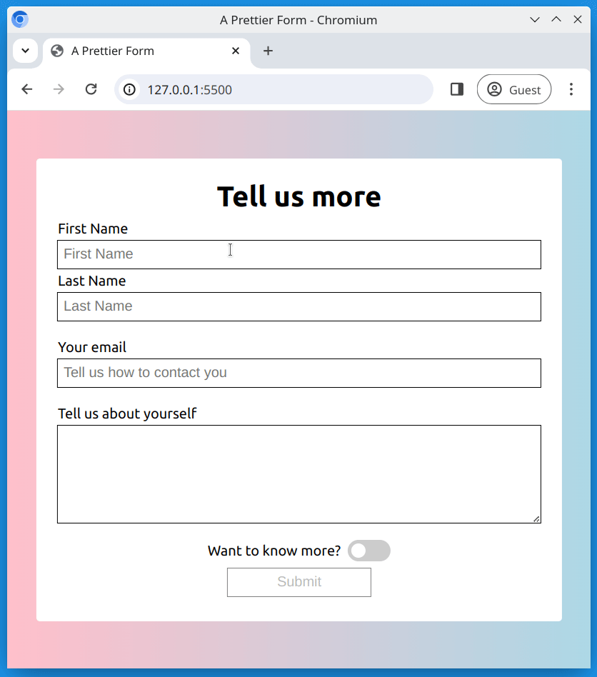

# Outlining form fields

Let's extend our knowledge with forms, by using some more advanced techniques!

## Task

Working in the files [index.html](./index.html) and [style.css](./style.css), create a form which meets the following requirements. Your finished result should look like the reference image below.

## Requirements

- Use `<input>` or `<textarea>` fields to collect the following information;
  - First name
  - Last name
  - Email
  - Tell us about yourself
- Use a `<label>` tags for each form element
- The form should also have a checkbox which is styled as a toggle switch
- Use CSS attribute selectors to target and style;
  - `text` type input fields should have a `hotpink` outline on focus
  - The input field with the type `email` and the `<textarea>` should have a `blue` outline on focus
- At the end of the form, there should be an input for submit. This input field should be `disabled`.

## Reference Image

## Bonus Task

- Remove the `disabled` attribute from the submit button
- Add form validation
- Connect the form to [formspree.io](https://formspree.io/) so you can collect user input

[//]: # (autograding info start)
#  Results
> ⌛ Give it a minute. As long as you see the orange dot  on top, CodeBuddy is still processing. Refresh this page to see it's current status.
>
> This is what CodeBuddy found when running your code. It is to show you what you have achieved and to give you hints on how to complete the exercise.

### HTML structure

|                 Status                  | Check                                                                                    |
| :-------------------------------------: | :--------------------------------------------------------------------------------------- |
|  | Index file should contain appropriate meta tags |
|  | Index file Should contain a title tag that is not empty |

### Form Input fields

|                 Status                  | Check                                                                                    |
| :-------------------------------------: | :--------------------------------------------------------------------------------------- |
|  | Inputs should have corresponding label tags |
|  | 'First Name' and 'Last Name' input fields should exist and be of type='text' |
|  | 'Email' Input field should exist |
|  | Page should contain a 'Textarea' field |

### Form Styling

|                 Status                  | Check                                                                                    |
| :-------------------------------------: | :--------------------------------------------------------------------------------------- |
|  | Input fields with type='text' attribute Should have a hotpink color outline styling focus |
|  | 'Email' & 'textarea' Input fields should have blue color outline styling on focus |

### Submit

|                 Status                  | Check                                                                                    |
| :-------------------------------------: | :--------------------------------------------------------------------------------------- |
|  | Input with the type='submit' Should exist and be disabled |

[🔬 Results Details](../../actions)
[🐞 Tips on Debugging](https://github.com/DCI-EdTech/autograding-setup/wiki/How-to-work-with-CodeBuddy)
[📢 Report Problem](https://docs.google.com/forms/d/e/1FAIpQLSfS8wPh6bCMTLF2wmjiE5_UhPiOEnubEwwPLN_M8zTCjx5qbg/viewform?usp=pp_url&entry.652569746=uib-data-outlining-form-fields)

[//]: # (autograding info end)