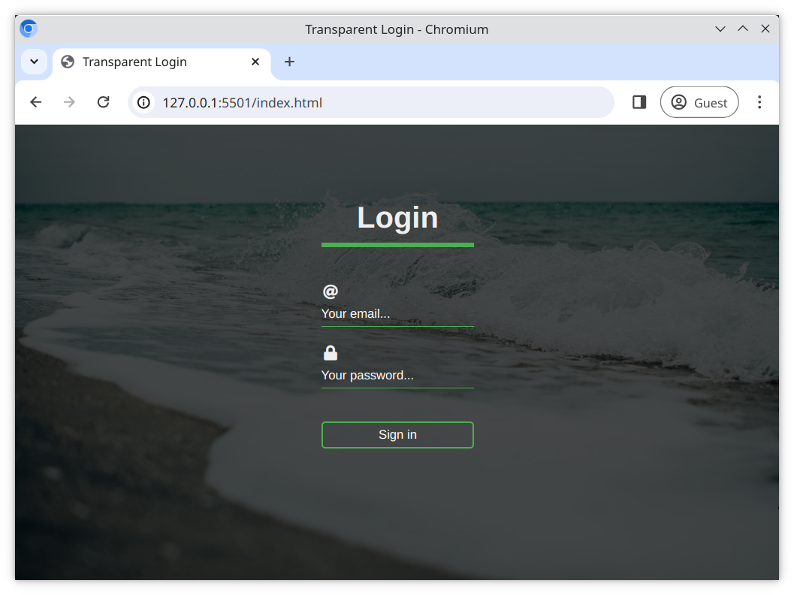

# Transparent Forms

A transparent form is a popular design trend where the form elements appear to be part of the background. Now you'll get a chance to try this yourself!

## Task

Working in the files [index.html](./index.html) and [style.css](./style.css), create a form which meets the following requirements.

## Requirements

- The form should be centered in the body
- You can find the background image in [assets/background.jpg](/assets/background.jpg). The image should cover the whole body.
- A gradient should be applied over body and the background image for a darkened filter effect
- All `<input>` fields should be transparent
- The placeholder text of inputs should be bold on field selection
- Use [Font Awesome](https://fontawesome.com/) icons for the input fields

> Don't forget to begin your webpage with the boilerplate HTML5 code!

## Reference Image

[//]: # (autograding info start)
#  Results
> ⌛ Give it a minute. As long as you see the orange dot  on top, CodeBuddy is still processing. Refresh this page to see it's current status.
>
> This is what CodeBuddy found when running your code. It is to show you what you have achieved and to give you hints on how to complete the exercise.

### Transparent Login

|                 Status                  | Check                                                                                    |
| :-------------------------------------: | :--------------------------------------------------------------------------------------- |
|  | Index file should contain appropriate meta tags |
|  | Index file Should contain a title tag that is not empty |
|  | The content on the page should be centered |
|  | Body tag Should contain a background image that covers the whole page |
|  | A gradient Should be applied to body tag for dark filter effect |
|  | All Inputs should have a 'transparent' styling |
|  | All Placeholders of the input fields should be styled as Bold when field is selected |
|  | Font awesome CDN should be present in the `head` |
|  | Input fields should have font awesome icons |

[🔬 Results Details](../../actions)
[🐞 Tips on Debugging](https://github.com/DCI-EdTech/autograding-setup/wiki/How-to-work-with-CodeBuddy)
[📢 Report Problem](https://docs.google.com/forms/d/e/1FAIpQLSfS8wPh6bCMTLF2wmjiE5_UhPiOEnubEwwPLN_M8zTCjx5qbg/viewform?usp=pp_url&entry.652569746=uib-data-transparent-login-form)

[//]: # (autograding info end)