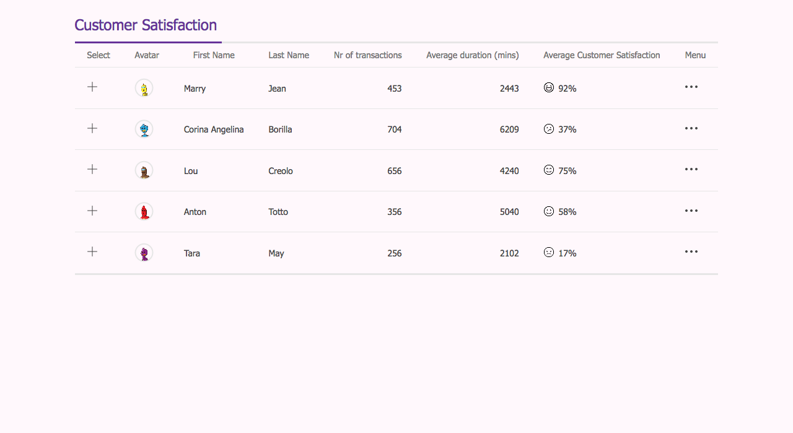
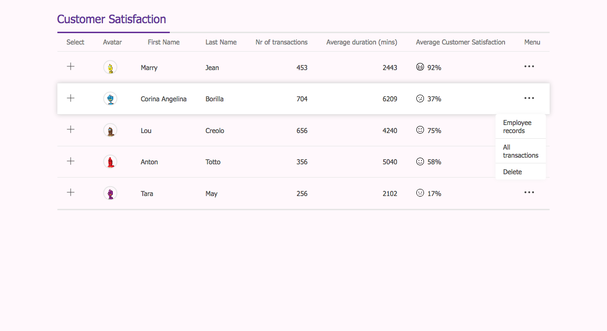
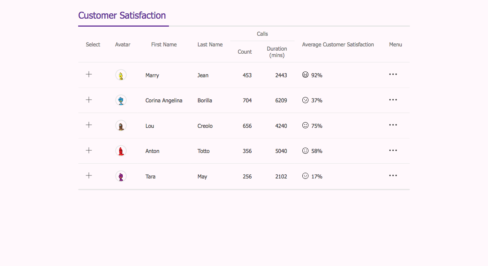

# Customer Satisfaction Dashboard

Taking advantage of everything we've learned in this module, create a customer satisfaction dashboard as shown in the mockup below:

### Instructions

- Use a table to create the dashboard layout. Center your table in the middle of the page.
- Work in the existing `index.html` and `style.css` files.
- Use the provided images in the `images` folder to create the icons for the dashboard.
- columns that contain numbers are aligned right
- there is a hover effect when hovering on different rows
- Use the `more.svg` icon from `images` folder for the Menu options and display dropdown on hover of icon

#### Bonus

- sticky header -> see what issues you might run into
- responsive -> no overflow of entire page
- split column header

  

> Note: You can use `https://robohash.org/` for the avatar images.
> Specify any string after the URL to get a random robot avatar:
> `https://robohash.org/marry` or `https://robohash.org/lou` or even `https://robohash.org/fghjklhgfhj`.

[//]: # (autograding info start)
#  Results
> ⌛ Give it a minute. As long as you see the orange dot  on top, CodeBuddy is still processing. Refresh this page to see it's current status.
>
> This is what CodeBuddy found when running your code. It is to show you what you have achieved and to give you hints on how to complete the exercise.

### Table

|                 Status                  | Check                                                                                    |
| :-------------------------------------: | :--------------------------------------------------------------------------------------- |
|  | A table is used to create dashboard layout |
|  | table has 8 columns |

### Styling

|                 Status                  | Check                                                                                    |
| :-------------------------------------: | :--------------------------------------------------------------------------------------- |
|  | Icons from the `images` folder are used |
|  | Dropdown has `hover` effect |

[🔬 Results Details](../../actions)
[🐞 Tips on Debugging](https://github.com/DCI-EdTech/autograding-setup/wiki/How-to-work-with-CodeBuddy)
[📢 Report Problem](https://docs.google.com/forms/d/e/1FAIpQLSfS8wPh6bCMTLF2wmjiE5_UhPiOEnubEwwPLN_M8zTCjx5qbg/viewform?usp=pp_url&entry.652569746=UIB-layout-customer-satisfaction-dashboard)

[//]: # (autograding info end)