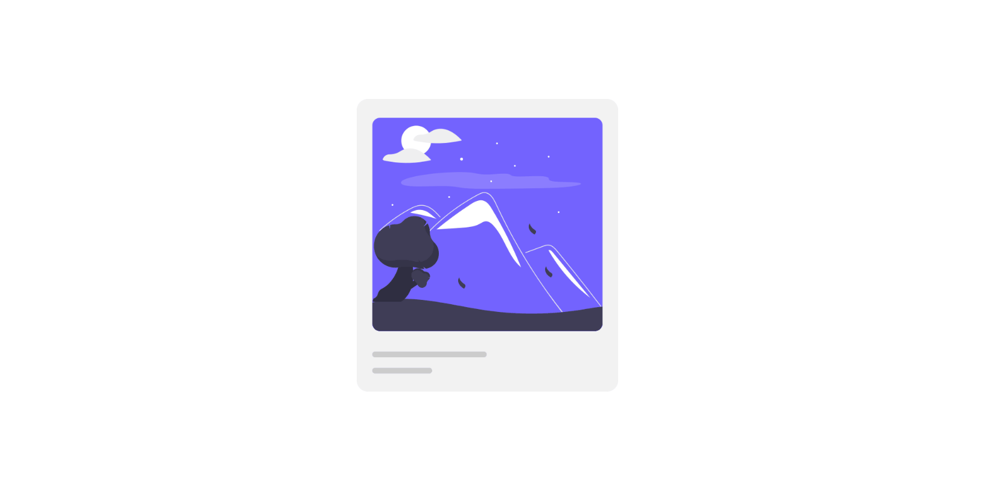

# Caption This

Let's try to recreate the hover animation shown below:

## Objectives / Info

- Use the `transition` property for a smooth transition.
- `relative` / `absolute` positioning and the `overflow` property may be useful for this.
- You can use `image.png` from the provided `images` folder
- Try to make it as close to the example as possible.
- Have fun 🐱‍💻🐱‍🏍

[//]: # (autograding info start)
#  Results
> ⌛ Give it a minute. As long as you see the orange dot  on top, CodeBuddy is still processing. Refresh this page to see it's current status.
>
> This is what CodeBuddy found when running your code. It is to show you what you have achieved and to give you hints on how to complete the exercise.

### Interaction

|                 Status                  | Check                                                                                    |
| :-------------------------------------: | :--------------------------------------------------------------------------------------- |
|  | Stylesheet should be linked |
|  | On hover the opacity of the caption element should change to 1 |
|  | Image should scale and rotate on hover |

[🔬 Results Details](../../actions)
[🐞 Tips on Debugging](https://github.com/DCI-EdTech/autograding-setup/wiki/How-to-work-with-CodeBuddy)
[📢 Report Problem](https://docs.google.com/forms/d/e/1FAIpQLSfS8wPh6bCMTLF2wmjiE5_UhPiOEnubEwwPLN_M8zTCjx5qbg/viewform?usp=pp_url&entry.652569746=UIB-Interactions-Caption-This)

[//]: # (autograding info end)