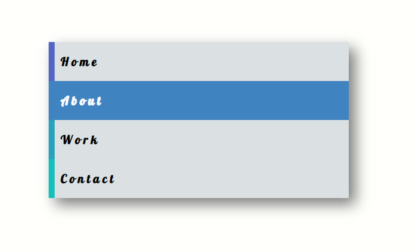

# Website-Menü

Sieh dir das Beispiel an und versuche, den Effekt nachzuahmen.
1. Verwende Anker-Tags, um 4 oder mehr Menüpunkte zu erstellen.
3. Gib jedem Link eine einzigartige `background-color`.
4. Nutze die CSS-Eigenschaften `transition` und `transform`, um einen sanften Übergang beim Überfahren mit der Maus zu erzeugen.

