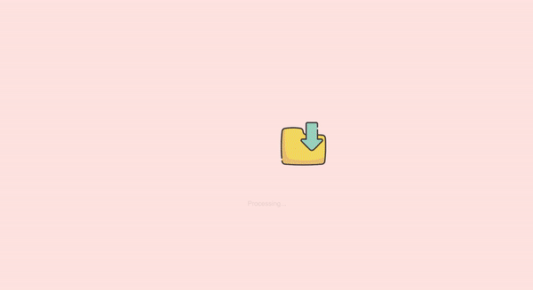

# Processing files

Create a processing files animation. Start with the existing `index.html` and `styles/index.css` files and icons in the `images` folder.

Looks like there are images included in the starting HTML, but if you try to open the website with a browser, the images don't work! Find and fix the issue.

Processing Example:

[Or watch reference video for better quality](./processing.mp4)

[//]: # (autograding info start)
#  Results
> ⌛ Give it a minute. As long as you see the orange dot  on top, CodeBuddy is still processing. Refresh this page to see it's current status.
>
> This is what CodeBuddy found when running your code. It is to show you what you have achieved and to give you hints on how to complete the exercise.

### Images

|                 Status                  | Check                                                                                    |
| :-------------------------------------: | :--------------------------------------------------------------------------------------- |
|  | Provided images show up on screen |

### Animation

|                 Status                  | Check                                                                                    |
| :-------------------------------------: | :--------------------------------------------------------------------------------------- |
|  | Multi step animations are used |
|  | A looping animation is used |
|  | An animation is used that persists the final state |
|  | Animations run sequentially as opposed to parallel (some start with a delay) |

[🔬 Results Details](../../actions)
[🐞 Tips on Debugging](https://github.com/DCI-EdTech/autograding-setup/wiki/How-to-work-with-CodeBuddy)
[📢 Report Problem](https://docs.google.com/forms/d/e/1FAIpQLSfS8wPh6bCMTLF2wmjiE5_UhPiOEnubEwwPLN_M8zTCjx5qbg/viewform?usp=pp_url&entry.652569746=UIB_interaction_animations_processing_files)

[//]: # (autograding info end)