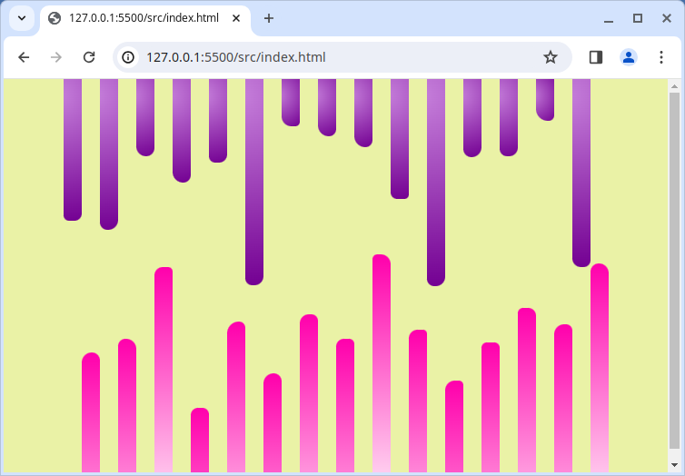

# Zufällige Stäbe

Lass uns ein paar zufällige Balken mit SASS erstellen. Ein großer Teil dieser herausfordernden Übung besteht aus Recherche und Experimentieren. Versuche den Stil des Beispielbildes mit zufälligen Border-Radiuses und Balkenhöhen nachzuahmen.



Um das Projekt auszuführen, führe folgendes in deinem Terminal aus:

```bash
$ npm install && npm start
```

Wir können [SASS-Schleifen](https://sass-lang.com/documentation/at-rules/control/for) und die in SASS eingebaute Funktion `random()` verwenden.

## Bonus

Die Bonus-Herausforderung besteht diesmal darin, die Balken zu animieren, um ihre Höhe zu ändern, aber die Geschwindigkeit zufällig zu gestalten.
