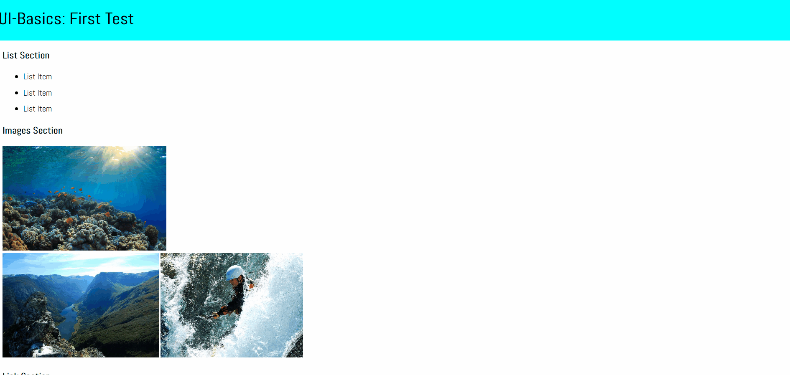
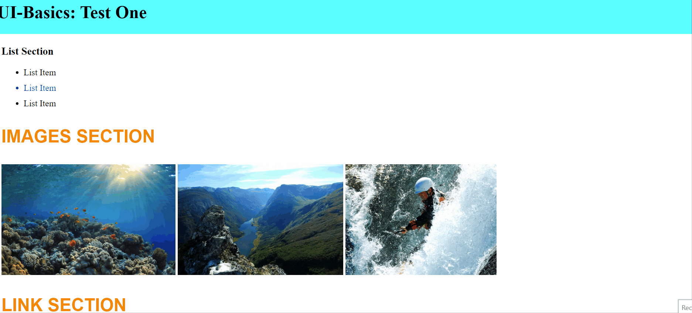
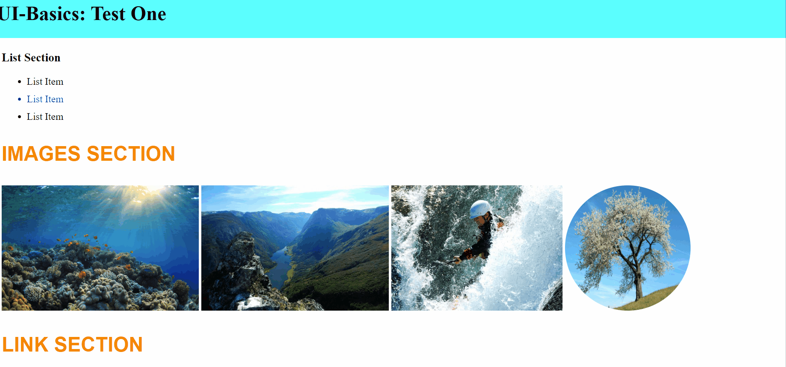

# UI-Basics Test: Erster Test

* Arbeite mit der Datei "index.html" und einem CSS-Stylesheet.
* Du darfst online recherchieren, aber schreibe deinen eigenen Code - verwende keine künstliche Intelligenz.
* Du darfst keine Hilfe von Mitschülern oder Lehrern in Anspruch nehmen, um die Aufgaben zu lösen
* Du darfst die Lehrer bitten, eine Aufgabe zu erklären (in angemessenem Rahmen)
* Viel Glück!

## Anfangen
* Erstelle und verlinke ein CSS-Stylesheet und arbeite von dort aus.

* Benutze die Positionierung, um die Kopfzeile (header) am oberen Rand der Seite zu fixieren. Sie sollte 100% des verfügbaren Platzes einnehmen und keinen der darunter liegenden Inhalte verdecken. Gib der Kopfzeile eine Hintergrundfarbe von **cyan**.

## Content Styling
* Ändere im Abschnitt (section) "_List_" die Farbe des zweiten Listenelements auf blau.

* Im Abschnitt "_Images_" lässt du alle Bilder nebeneinander erscheinen.

* Gib drei `h3`-Elementen im HTML-Dokument die gleiche Klasse.

* Verwende die Klasse, die du den Elementen gegeben hast, und ändere die Farbe dieser drei `h3`-Elemente mit rbg in Orange. Die Größe des Textes sollte `2em` sein. Der Text sollte in Großbuchstaben (uppercase) erscheinen. Du solltest die Großbuchstaben jedoch nicht manuell eingeben. Du solltest googeln, um die CSS-Eigenschaft zu finden und zu verwenden, mit der du festlegen kannst, wie der Text eines Elements großgeschrieben werden soll.

* Markiere alle untergeordneten Links in der Fußzeile. Ändere die Farbe der Links auf grün bei `visited` und rot bei `hover`.

## Box Model
* Im Abschnitt "_Box Model_" fügst du dem Element "Section", das einen Paragraphen und ein Bild enthält, `5 pixels` `padding` hinzu.

* Stelle im Abschnitt "_Box Model_" sicher, dass die margin des Section-Elements, das einen Paragraphen und ein Bild enthält, `10%` der Breite des Elternelements beträgt.

## Bilder & Links
* Füge im Abschnitt "_Link_" einen Link ein, der den Nutzer zu einem Coverbild deines Lieblingsbuchs weiterleitet. Achte darauf, dass das Bild in einem neuen Tab geöffnet wird.

* Füge im Abschnitt "_Images_" das Bild `tree.jpg` aus dem Bilderordner ein. Lasse das Bild kreisförmig erscheinen. Mache aus dem Bild einen Link, der zu [dieser Adresse](https://caseytrees.org/tree-species/) führt.

## Hierarchie
* Verschiebe die Fußzeile (footer) in HTML an das Ende des Dokuments.

